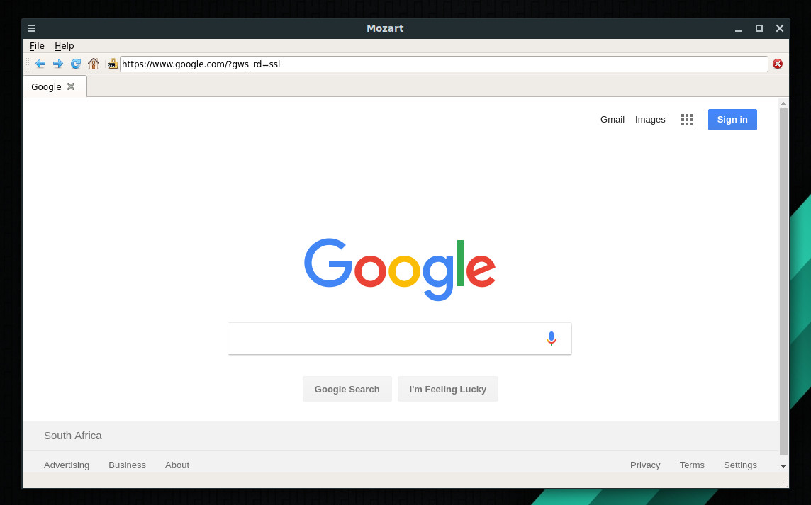

# Mozart — A Simple Web Browser

Mozart is a simple QT web browser with Python (PyQT 5) under the hood.
Any similarity to other browsers is entirely coincidental.

## Code notes

### Tabbing

Adding tab support complicates the internals of the browser a bit, since we
now need to keep track of the currently active browser view, both to update
UI elements (URL bar, HTTPs icon) to changing state in the currently active
window, and to ensure the UI events are dispatched to the correct web view.

This is achieved by using intermediate slots which filter events, and by
adding signal redirection (using lamba functions to keep it short).

### HTOUKOUR COGNITIVE 2018
https://htoukour.co.za
